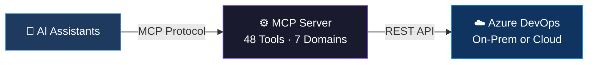
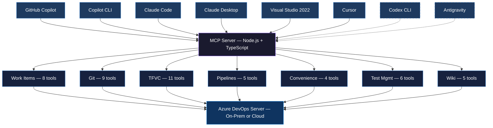
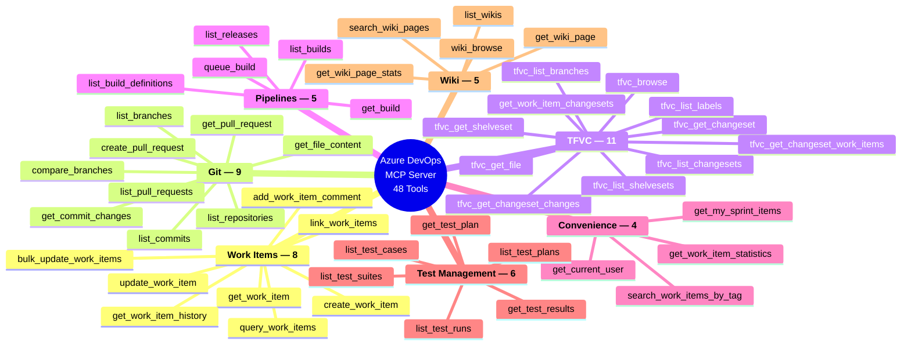

<div align="center">

# Azure DevOps MCP Server

[](https://nodejs.org/)
[](https://www.typescriptlang.org/)
[](https://modelcontextprotocol.io/)
[](https://learn.microsoft.com/en-us/azure/devops/server/)
[](LICENSE)
[](https://github.com/burcusipahioglu/azure-devops-mcp-onprem#tool-reference)

This MCP server enables AI assistants to work with on-premises Azure DevOps Server.

→ Query work items, repositories, and pipelines using natural language
→ Runs locally without requiring a cloud proxy
→ Supports both Git and TFVC workflows (including shelvesets, changesets, and labels)

[Quick Start](#quick-start-for-individuals) · [Enterprise Setup](#enterprise-setup-for-teams) · [Privacy](#privacy--data-flow) · [Tool Reference](#tool-reference) · [Multi-Instance](#multi-instance-setup) · [Security](#security)

</div>

---

> Runs locally with no telemetry or cloud proxy. [Privacy details ↓](#privacy--data-flow)

---

### Example questions

> *"Show me all active bugs assigned to me in this sprint"*
> *"What changed in changeset 12345?"*
> *"Create a PR from feature/login to develop"*
> *"Trigger the nightly build on the release branch"*
> *"List my latest shelvesets"*

### Designed for Enterprise

Built for on-prem Azure DevOps (TFS) environments.

Supports both Git and TFVC, runs locally without external dependencies, and can be configured for multiple teams or collections.

### Key Features

| | Feature | Details |
|---|---------|---------|
| **On-Premises** | Azure DevOps Server 2022.2 | Targets self-hosted TFS / Azure DevOps Server — PAT auth, self-signed SSL support |
| **TFVC Support** | Shelvesets, changesets, labels | 11 TFVC tools covering legacy version control workflows |
| **48 Tools** | 7 domains | Work Items, Git, TFVC, Pipelines, Wiki, Test Plans, Convenience (selectively loadable via `AZURE_DEVOPS_ENABLED_DOMAINS`) |
| **Multi-Instance** | Multiple TFS servers | `AZURE_DEVOPS_PROFILE` loads `.env.<name>` — run against several TFS instances simultaneously |
| **`@me` Token** | Current-user shortcut | `owner` / `author` / `assignedTo` accept `@me` — resolved per tenant, stateless for multi-agent setups |
| **Multi-Client** | MCP-compatible clients | Tested: Claude Code/Desktop, GitHub Copilot, Cursor, Visual Studio 2022. Should work with any MCP-compatible client (e.g., Codex CLI, Antigravity) |
| **Safe Writes** | Confirmation required | All mutating tools need explicit user approval; WIQL injection prevention; bounded pagination; scrubbed errors |

---

## Overview



## Architecture



## Tool Overview



### Restrict which tool domains load

The 48 tools are grouped into 7 domains. By default all 7 load. If you only need a subset, set `AZURE_DEVOPS_ENABLED_DOMAINS` in your `.env` to a comma-separated list — disabled domains' tools are not registered, which trims the AI client's tool list and reduces tool-selection confusion.

Valid domains: `work_items`, `git`, `tfvc`, `pipelines`, `wiki`, `test_plans`, `convenience`.

Role-based examples:

| Role | `AZURE_DEVOPS_ENABLED_DOMAINS` |
|------|--------------------------------|
| Project manager | `work_items,convenience,wiki` |
| Developer (TFVC) | `work_items,tfvc,pipelines,convenience` |
| Developer (Git) | `work_items,git,pipelines,convenience` |
| QA / tester | `work_items,test_plans,git` |
| DevOps / release | `work_items,pipelines,git,tfvc` |
| Read-only / analyst | `work_items,wiki,convenience` |

Unknown domain names cause the server to fail at startup, so typos surface immediately rather than silently dropping tools. Leave the variable unset (or empty) to load all 7 domains.

The startup log reports which domains were enabled and disabled, e.g.:

```
Enabled domains (4/7): work_items, tfvc, pipelines, convenience
Disabled domains: git, wiki, test_plans
```

## Privacy & Data Flow

**This server runs entirely locally.** TFS API calls go directly from your machine to your Azure DevOps Server over your network. No data — work items, code, PATs, anything — is sent to the package author or any third-party service.

The only external destinations are:

1. **Your own Azure DevOps Server** — the URL you configure in `.env`.
2. **Your chosen AI assistant** (Claude, GitHub Copilot, Cursor) — the AI client reads tool outputs as conversation context per its own privacy policy. The MCP server itself never talks to these services; the AI client does.

There is **no telemetry, no phone-home, no cloud proxy, no shared analytics**. You can verify this claim by reading [`src/`](src/) — every network call goes through `azure-devops-node-api` pointed at your configured URL.

| Data | Leaves your machine? |
|------|----------------------|
| PAT | ❌ Never — stored in gitignored `.env`, read only by the local server process |
| Work items, code, commits, shelvesets | ➡ Only to your configured Azure DevOps Server, then back to the AI assistant the user chose |
| Server/URL/project names | ➡ Only to the AI assistant as part of tool outputs |
| Usage metrics, error logs | ❌ No collection — errors are scrubbed and returned to the client only |

## Prerequisites

- **Node.js** >= 18 (required for both Quick Start and Enterprise Setup).
- **Azure DevOps Server 2022.2 on-premises** (tested). Older TFS versions with REST API 7.x likely work but are untested.
- **Personal Access Token (PAT)** with the scopes listed below.

### PAT scopes

Grant only what you need. Omit scopes for domains you don't plan to use — the affected tools will fail at call time, but the server will still start.

| Scope | Permission | Required for |
|-------|-----------|---------|
| **Work Items** | Read & Write | Work item tools, convenience tools, WIQL queries |
| **Code** | Read & Write | Git tools, **TFVC tools** (shelvesets, changesets, labels), PR creation |
| **Build** | Read & Execute | Pipeline tools, `queue_build` |
| **Release** | Read | Release listing |
| **Test Management** | Read | Test plans, suites, runs, results |
| **Wiki** | Read & Write | Wiki tools (page fetch, search, stats) |

### How to create a PAT

1. Open your Azure DevOps Server / TFS web UI.
2. Profile icon (top-right) → **Security** → **Personal access tokens** → **New Token**.
3. Name it (e.g. `Azure_DevOps_MCP_Server`).
4. Check the scopes from the table above.
5. Set an **expiration ≤ 90 days** and rotate regularly.
6. Copy the token immediately — it's only shown once. Paste it into your `.env` file.

## Quick Start (For Individuals)

No cloning, no build — run straight from npm. Takes about 2 minutes end-to-end.

> **No public npm access?** If your network or organization blocks the public npm registry, skip this section and follow [Enterprise Setup](#enterprise-setup-for-teams) instead — it builds from source and only needs `npm install` (which can use an internal mirror if configured).

**1. Get a PAT** from your Azure DevOps Server with the scopes in [Prerequisites](#prerequisites).

**2. Create a credential file** somewhere under your home folder — e.g. `~/.azure-devops-mcp.env` (Linux/macOS) or `C:\Users\you\.azure-devops-mcp.env` (Windows):

```env
AZURE_DEVOPS_ORG_URL=https://your-tfs-server/tfs/YourCollection
AZURE_DEVOPS_PROJECT=YourProjectName
AZURE_DEVOPS_PAT=your_pat_token
# AZURE_DEVOPS_SSL_IGNORE=true   # uncomment for self-signed certs

# Optional: load only the tool domains you need (smaller AI tool list,
# fewer mis-selections). Leave unset to load all 7 domains.
# Valid: work_items, git, tfvc, pipelines, wiki, test_plans, convenience
# AZURE_DEVOPS_ENABLED_DOMAINS=work_items,tfvc,pipelines,convenience
```

Lock it so only you can read it:

```bash
# Linux / macOS
chmod 600 ~/.azure-devops-mcp.env

# Windows (PowerShell or bash)
icacls "%USERPROFILE%\.azure-devops-mcp.env" /inheritance:r /grant:r "%USERNAME%:R"
```

**3. Register the server with your AI client.** Pick the shortest path for your setup:

#### VS Code — one-click install

<p align="center">
  <a href="https://insiders.vscode.dev/redirect/mcp/install?name=azure-devops-mcp-onprem&config=%7B%22type%22%3A%22stdio%22%2C%22command%22%3A%22npx%22%2C%22args%22%3A%5B%22-y%22%2C%22%40burcusg%2Fazure-devops-mcp-onprem%22%5D%2C%22env%22%3A%7B%22AZURE_DEVOPS_ENV_FILE%22%3A%22%24%7BuserHome%7D%2F.azure-devops-mcp.env%22%7D%7D">
    
  </a>
</p>

Click → VS Code opens with the config pre-filled → confirm. Works for VS Code 1.90+ with GitHub Copilot (Agent mode) or any MCP extension.

#### Claude Code (CLI) — one command

```bash
claude mcp add azure-devops -- npx -y @burcusg/azure-devops-mcp-onprem --env AZURE_DEVOPS_ENV_FILE=$HOME/.azure-devops-mcp.env
```

No JSON editing required.

#### Claude Desktop / Cursor / other clients — JSON config

Edit your client's MCP config file (Claude Desktop: `%APPDATA%\Claude\claude_desktop_config.json` on Windows or `~/Library/Application Support/Claude/claude_desktop_config.json` on macOS):

```json
{
  "mcpServers": {
    "azure-devops": {
      "command": "npx",
      "args": ["-y", "@burcusg/azure-devops-mcp-onprem"],
      "env": {
        "AZURE_DEVOPS_ENV_FILE": "C:\\Users\\you\\.azure-devops-mcp.env"
      }
    }
  }
}
```

Restart the client. All 48 tools appear in the tool picker. First `npx` run downloads the package (~60 seconds); subsequent runs are instant from the cache.

> **Why no PAT in the config file?** Client configs sync to the cloud (Claude Desktop sync, VS Code Settings Sync) or get pasted into tickets. Keep credentials in the OS file; the server reads them via `AZURE_DEVOPS_ENV_FILE`.

---

## Enterprise Setup (For Teams)

Use this path if you want to pin a specific commit, audit the code, add custom tools, or run offline without npm network access.

### Step 1: Clone and Install

```bash
git clone https://github.com/burcusipahioglu/azure-devops-mcp-onprem.git
cd azure-devops-mcp-onprem
npm install
```

✅ Expected: No errors, `node_modules/` created.

### Step 2: Build TypeScript

```bash
npm run build
```

✅ Expected: No TypeScript errors, `dist/` folder populated.

### Step 3: Configure credentials

Copy the template:

```bash
cp .env.example .env
```

Fill in `.env` with your Azure DevOps details:

```env
AZURE_DEVOPS_ORG_URL=https://your-tfs-server/tfs/YourCollection
AZURE_DEVOPS_PROJECT=YourProjectName
AZURE_DEVOPS_PAT=your_pat_token
# AZURE_DEVOPS_SERVER_NAME=CustomDisplayName   # optional, auto-derived from URL
# AZURE_DEVOPS_SSL_IGNORE=true                 # only for self-signed certs

# Optional: restrict tool domains (see "Restrict which tool domains load" above).
# Leave unset to load all 7 domains.
# AZURE_DEVOPS_ENABLED_DOMAINS=work_items,tfvc,pipelines,convenience
```

**Server name auto-detection** (displayed by the AI client):
- `https://dev.azure.com/acme` → `acme`
- `https://tfs.example.com/tfs/CompanyOrg` → `CompanyOrg`
- Override with `AZURE_DEVOPS_SERVER_NAME`

**`.env` is gitignored** and will not be committed. For multiple TFS instances, see [Multi-Instance Setup](#multi-instance-setup).

### Step 4: Verify

```bash
npm start
```

Expected startup output (to stderr):

```
Azure DevOps MCP Server "CompanyOrg" running on stdio
env file: /path/to/.env
Authenticated as: Your Name (your.email@company.com)
```

Stop with `Ctrl+C`.

### Step 5: Point your AI client at `dist/index.js`

```json
{
  "mcpServers": {
    "azure-devops": {
      "command": "node",
      "args": ["/absolute/path/to/azure-devops-mcp-onprem/dist/index.js"]
    }
  }
}
```

No `env` block needed — the server loads `.env` from the repo root.

---

## Configure Your AI Assistant

The examples below show configs for each major MCP client. Pick the style that matches your setup path:

- **Quick Start path** → `command: "npx"` + `AZURE_DEVOPS_ENV_FILE` pointing to your credential file.
- **Enterprise Setup path** → `command: "node"` pointing at `dist/index.js`, with `.env` in the repo root (no `env` block needed in `mcp.json`).

> **⚠ Never inline `AZURE_DEVOPS_PAT` / `AZURE_DEVOPS_ORG_URL` / `AZURE_DEVOPS_PROJECT` in the client config.** These files sync to the cloud (Claude Desktop sync, VS Code Settings Sync) or get pasted into tickets. Use `AZURE_DEVOPS_ENV_FILE` for Quick Start, or `.env` in the repo for Enterprise Setup. For multiple TFS instances, see [Multi-Instance Setup](#multi-instance-setup).

#### Visual Studio 2022 (17.14+)

The project includes `.mcp.json` in the root — VS 2022 picks it up automatically when you open the solution/folder. No extra setup needed.

1. Open the project folder or solution in VS 2022
2. Open Copilot Chat (`Ctrl+\, Ctrl+C`)
3. Select **Agent** mode
4. The Azure DevOps tools appear automatically

> **Requirement:** Visual Studio 2022 version 17.14 or later with GitHub Copilot extension.

If you prefer manual configuration, add to `<SolutionDir>\.mcp.json`:

```json
{
  "servers": {
    "azure-devops": {
      "type": "stdio",
      "command": "node",
      "args": ["dist/index.js"]
    }
  }
}
```

#### VS Code

The project includes `.vscode/mcp.json`. Open Copilot Chat (`Ctrl+Shift+I`), select **Agent** mode, and start asking questions.

#### GitHub Copilot CLI

```bash
# Interactive — prompts for command, args, and env vars
/mcp add

# Or edit the config file directly
# Windows: %USERPROFILE%\.copilot\mcp-config.json
# macOS/Linux: ~/.copilot/mcp-config.json
```

Config file format (`mcp-config.json`):

```json
{
  "servers": {
    "azure-devops": {
      "type": "stdio",
      "command": "node",
      "args": ["C:\\path\\to\\azure-devops-mcp-onprem\\dist\\index.js"]
    }
  }
}
```

Useful commands inside Copilot CLI:
- `/mcp show` — list all configured servers
- `/mcp edit azure-devops` — modify server config
- `/mcp disable azure-devops` / `/mcp enable azure-devops` — toggle on/off
- `/mcp delete azure-devops` — remove

#### Claude Code (CLI)

```bash
claude mcp add azure-devops -- node /path/to/azure-devops-mcp-onprem/dist/index.js
```

#### Claude Desktop

Add to `%APPDATA%\Claude\claude_desktop_config.json` (Windows) or `~/Library/Application Support/Claude/claude_desktop_config.json` (macOS).

**Secrets stay in `.env`** (from [Enterprise Setup Step 3](#step-3-configure-credentials)). The client config only points at the server binary:

**Windows:**
```json
{
  "mcpServers": {
    "azure-devops": {
      "command": "node",
      "args": ["C:\\path\\to\\azure-devops-mcp-onprem\\dist\\index.js"]
    }
  }
}
```

**macOS / Linux:**
```json
{
  "mcpServers": {
    "azure-devops": {
      "command": "node",
      "args": ["/path/to/azure-devops-mcp-onprem/dist/index.js"]
    }
  }
}
```

> Do **not** put `AZURE_DEVOPS_PAT` / `AZURE_DEVOPS_ORG_URL` / `AZURE_DEVOPS_PROJECT` under an `env` block here. The server reads them from the gitignored `.env` file automatically.

**Server name:** Auto-detected from `AZURE_DEVOPS_ORG_URL` in `.env`:
- `https://dev.azure.com/acme` → server name = `acme`
- `https://my-tfs.company.com/tfs/MyOrg` → server name = `MyOrg`
- Override by setting `AZURE_DEVOPS_SERVER_NAME` in `.env`.

After saving:
1. Restart Claude Desktop
2. Look for the 🔧 icon — it should show your server name, and the tools appear in the tool picker.

## Multi-Instance Setup

The same server binary can run as multiple instances to connect to different Azure DevOps organizations/projects simultaneously.

**Principle:** keep secrets (`AZURE_DEVOPS_PAT`, URL, project) in gitignored `.env.<profile>` files. The MCP client config only references the profile name — no secrets committed to `mcp.json`.

### How .env loading works

At startup, the server picks an env file using this precedence:

| Env var set in mcp.json | File loaded |
|--------------------------|-------------|
| `AZURE_DEVOPS_ENV_FILE=/abs/or/rel/path` | That exact path |
| `AZURE_DEVOPS_PROFILE=product-a` | `<projectRoot>/.env.product-a` |
| _(none)_ | `<projectRoot>/.env` (single-instance default) |

Variables already present in `process.env` always win — so anything you put directly in the mcp.json `env` block overrides the file.

### Recommended pattern: one .env per profile

Create files next to `.env`:

```
Azure_DevOps_MCP_Server/
  .env.product-a    # gitignored — PAT, URL, project for Product A's TFS
  .env.product-b    # gitignored — PAT, URL, project for Product B's TFS
  .env.example      # committed — template
```

`.env.product-a`:

```env
AZURE_DEVOPS_ORG_URL=https://tfs-1.example.com/tfs/ProductACollection
AZURE_DEVOPS_PROJECT=Product A
AZURE_DEVOPS_PAT=<pat-for-product-a>
AZURE_DEVOPS_SSL_IGNORE=false
# Per-profile domain restriction — e.g. Product A only needs Git + work items
# AZURE_DEVOPS_ENABLED_DOMAINS=work_items,git,pipelines,convenience
```

`mcp.json` — secrets-free, safe to commit:

```json
{
  "mcpServers": {
    "azure-devops-product-a": {
      "command": "node",
      "args": ["/path/to/dist/index.js"],
      "env": {
        "AZURE_DEVOPS_PROFILE": "product-a",
        "AZURE_DEVOPS_SERVER_NAME": "azure-devops-product-a"
      }
    },
    "azure-devops-product-b": {
      "command": "node",
      "args": ["/path/to/dist/index.js"],
      "env": {
        "AZURE_DEVOPS_PROFILE": "product-b",
        "AZURE_DEVOPS_SERVER_NAME": "azure-devops-product-b"
      }
    }
  }
}
```

Tool names are automatically prefixed by the MCP framework:
- `mcp__azure-devops-product-a__list_repositories`
- `mcp__azure-devops-product-b__list_repositories`

At startup the server logs which env file it loaded, e.g.:

```
Azure DevOps MCP Server "azure-devops-product-a" running on stdio
env file: /path/to/.env.product-a
Authenticated as: ...
```

### Alternative: explicit file path

If your .env files live outside the project directory (e.g. a shared secrets folder):

```json
"env": {
  "AZURE_DEVOPS_ENV_FILE": "C:/secrets/tfs-product-a.env",
  "AZURE_DEVOPS_SERVER_NAME": "azure-devops-product-a"
}
```

### Secrets hygiene

- **Do not inline secrets in `mcp.json`.** Client configs often sync to the cloud (Claude Desktop sync, VS Code Settings Sync, dotfile repos) or get pasted into tickets/chat. Any `AZURE_DEVOPS_PAT` in those files is one `git add .` away from a public leak.
- **Use `.env.<profile>` files instead.** `.gitignore` covers `.env` and `.env.*` (except `.env.example`) — profile files never land in a commit.
- **One PAT per TFS instance**, each with its own minimum scope set. Rotate on a 90-day cadence.
- **If a PAT was ever committed** (check `git log -p -S "AZURE_DEVOPS_PAT="`), revoke it at `https://<your-tfs>/_usersSettings/tokens` immediately — history rewrites miss mirrors, revocation is the only reliable remediation.
- **Restrict file permissions** (optional, recommended on shared machines):
  - **Linux / macOS:** `chmod 600 .env .env.*` — owner read/write only.
  - **Windows (PowerShell or bash):** `icacls .env /inheritance:r /grant:r "%USERNAME%:R"` (repeat for each `.env.<profile>`) — removes inherited ACLs, grants read-only access to the current user.

## Project Structure

```
src/
  config.ts                  Config interface + loadConfig() — reads env vars, validates AZURE_DEVOPS_ENABLED_DOMAINS
  constants.ts               Batch sizes, truncation limits, pagination thresholds
  index.ts                   Entry point — resolves env file, loads config, registers tool modules per enabled domain
  connection/
    provider.ts              IConnectionProvider + AzureDevOpsConnectionProvider — PAT auth, lazy WebApi connection, cached user identity
    context-types.ts         Per-API context types (WorkItemContext, GitContext, TfvcContext, BuildContext, ReleaseContext, TestContext, TestPlanContext, WikiContext)
  utils/
    tool-response.ts         withErrorHandling() — centralized error handling + error sanitization
    wiql.ts                  sanitizeWiqlValue() — WIQL injection prevention
    schemas.ts               topParam() / skipParam() — shared input validation schemas
    work-item-helpers.ts     extractDisplayValue() / batchGetWorkItems() — shared helpers
    me-resolver.ts           resolveMe() — expands '@me' token to current user's display name
    patch-document.ts        normalizeFieldPath() / buildUpdatePatchDocument() — JsonPatch helpers for work-item updates
  tools/
    work-items.ts            6 tools — WIQL queries, CRUD, comments, links
    work-items-advanced.ts   2 tools — change history, bulk update with before/after report
    git.ts                   6 tools — repos, branches, file content, pull requests
    git-advanced.ts          3 tools — commit history, commit changes, branch comparison
    pipelines.ts             5 tools — build definitions, builds, releases
    tfvc.ts                  11 tools — browse, files, changesets, shelvesets, labels, branches, work-item changesets
    convenience.ts           4 tools — sprint items, tag search, statistics, current user
    test-management.ts       6 tools — test plans, suites, cases, runs, results
    wiki.ts                  5 tools — list wikis, pages, browse, stats, search
```

## Tool Reference

### Work Items (6 tools)

| Tool | Description | Key Parameters |
|------|-------------|----------------|
| `query_work_items` | Execute a WIQL query | `query`, `top` |
| `get_work_item` | Get work item by ID | `id`, `expand` (none/relations/fields/links/all) |
| `create_work_item` | Create a new work item | `type`, `title`, `description`, `assignedTo` (accepts `@me`), `areaPath`, `iterationPath` |
| `update_work_item` | Update work item fields (returns before/after diff) | `id`, `fields` (key-value map) |
| `add_work_item_comment` | Add a comment | `workItemId`, `text` |
| `link_work_items` | Link two work items | `sourceId`, `targetId`, `linkType` |

### Work Items Advanced (2 tools)

| Tool | Description | Key Parameters |
|------|-------------|----------------|
| `get_work_item_history` | Full change audit trail (who/what/when with old/new values) | `workItemId`, `top`, `skip` |
| `bulk_update_work_items` | Batch update with detailed before/after report | `ids`, `fields` |

### Git (6 tools)

| Tool | Description | Key Parameters |
|------|-------------|----------------|
| `list_repositories` | List all Git repos in project | — |
| `list_branches` | List branches in a repo | `repositoryId` |
| `get_file_content` | Get file content from repo | `repositoryId`, `path`, `branch` |
| `list_pull_requests` | List PRs with filter | `repositoryId`, `status`, `top` |
| `get_pull_request` | Get PR details | `repositoryId`, `pullRequestId` |
| `create_pull_request` | Create a new PR | `repositoryId`, `title`, `sourceBranch`, `targetBranch` |

### Git Advanced (3 tools)

| Tool | Description | Key Parameters |
|------|-------------|----------------|
| `list_commits` | Commit history with filters | `repositoryId`, `branch`, `author` (accepts `@me`), `fromDate`, `toDate`, `itemPath` |
| `get_commit_changes` | File changes in a commit | `repositoryId`, `commitId` |
| `compare_branches` | Branch diff (ahead/behind + changed files) | `repositoryId`, `baseBranch`, `targetBranch` |

### TFVC (11 tools)

| Tool | Description | Key Parameters |
|------|-------------|----------------|
| `tfvc_browse` | Browse files/folders at a TFVC path | `scopePath`, `recursion` |
| `tfvc_get_file` | Get file content | `path`, `version` (changeset number) |
| `tfvc_get_changeset` | Get changeset details | `id`, `includeWorkItems`, `includeDetails` |
| `tfvc_list_changesets` | List changesets with filters | `itemPath`, `author` (accepts `@me`), `fromDate`, `toDate`, `top` |
| `tfvc_get_changeset_changes` | List file changes in a changeset | `changesetId`, `top` |
| `tfvc_get_changeset_work_items` | Get linked work items | `changesetId` |
| `tfvc_list_branches` | List TFVC branches | `includeChildren`, `includeDeleted` |
| `tfvc_list_shelvesets` | List shelvesets (sorted newest-first) | `owner` (accepts `@me`), `top` |
| `tfvc_get_shelveset` | Get shelveset details + changes | `shelvesetId`, `includeWorkItems` |
| `tfvc_list_labels` | List TFVC labels | `name`, `owner` (accepts `@me`), `top` |
| `get_work_item_changesets` | Get all TFVC changesets linked to a work item (with file changes) | `workItemId`, `includeFileContent`, `maxFiles` |

### Pipelines (5 tools)

| Tool | Description | Key Parameters |
|------|-------------|----------------|
| `list_build_definitions` | List pipeline definitions | `name`, `top` |
| `queue_build` | Trigger a build | `definitionId`, `sourceBranch`, `parameters` |
| `get_build` | Get build status | `buildId` |
| `list_builds` | List recent builds | `definitionId`, `status`, `top` |
| `list_releases` | List releases | `definitionId`, `top` |

### Convenience (4 tools)

| Tool | Description | Key Parameters |
|------|-------------|----------------|
| `get_my_sprint_items` | Get your current sprint items | `workItemType`, `states` |
| `search_work_items_by_tag` | Search work items by tags | `tags`, `workItemType`, `state`, `top` |
| `get_work_item_statistics` | Work item counts by area path (handles 20K+ items) | `workItemTypes`, `days`, `states`, `areaPathPrefix`, `areaPathContains`, `groupByDepth`, `topAreas` |
| `get_current_user` | Identity of the authenticated PAT owner (displayName, id, uniqueName) | — |

### Test Management (6 tools)

| Tool | Description | Key Parameters |
|------|-------------|----------------|
| `list_test_plans` | List test plans | `filterActivePlans`, `includePlanDetails` |
| `get_test_plan` | Get test plan details | `planId` |
| `list_test_suites` | List suites in a test plan | `planId`, `asTreeView` |
| `list_test_cases` | List test cases in a suite | `planId`, `suiteId` |
| `list_test_runs` | List test runs (manual/automated) | `planId`, `automated`, `top` |
| `get_test_results` | Test results with pass/fail and errors | `runId`, `outcomes`, `top` |

### Wiki (5 tools)

| Tool | Description | Key Parameters |
|------|-------------|----------------|
| `list_wikis` | List all wikis (project + code wikis) | — |
| `get_wiki_page` | Get page content in Markdown | `wikiIdentifier`, `path` |
| `wiki_browse` | Browse wiki page tree | `wikiIdentifier`, `path` |
| `get_wiki_page_stats` | Page view statistics | `wikiIdentifier`, `pageId`, `pageViewsForDays` |
| `search_wiki_pages` | Batch fetch pages with view stats | `wikiIdentifier`, `top` |

## Current User (@me)

Several filter parameters accept the magic token `@me` — the server resolves it to the authenticated PAT owner's display name via Azure DevOps `ConnectionData` API. The identity is cached for the lifetime of the process.

**Why:** In multi-agent setups, sub-agents rarely know the human's display name. Passing `@me` lets any agent filter to "my stuff" without needing identity context.

**Supported parameters:**

| Tool | Parameter |
|------|-----------|
| `tfvc_list_shelvesets` | `owner` |
| `tfvc_list_changesets` | `author` |
| `tfvc_list_labels` | `owner` |
| `list_commits` | `author` |
| `create_work_item` | `assignedTo` |

Need the identity explicitly? Call `get_current_user` — returns `{ displayName, id, uniqueName }`.

Example:

```jsonc
// "Show me my latest shelveset"
tfvc_list_shelvesets({ owner: "@me", top: 1 })

// "Which commits did I push to feature/login this week?"
list_commits({ repositoryId: "my-repo", branch: "feature/login", author: "@me", fromDate: "2026-04-10" })
```

> **Note:** WIQL queries (`query_work_items`, `get_my_sprint_items`) use Azure DevOps' native `@Me` macro — no server-side resolution needed.

## Write Operation Safety

All write operations require explicit user confirmation before execution. The AI assistant is instructed to:

1. Show the user exactly what will be changed
2. Ask for explicit approval before proceeding
3. Return detailed reports after execution

| Tool | Safety Level | Report |
|------|-------------|--------|
| `create_work_item` | Confirm before create | Returns created item ID and all fields |
| `update_work_item` | Confirm before update | Returns before/after diff for each field |
| `add_work_item_comment` | Confirm before post | Returns comment details |
| `link_work_items` | Confirm before link | Returns link confirmation |
| `bulk_update_work_items` | **Critical** — full impact summary required | Returns per-item before/after report |
| `create_pull_request` | Confirm before create | Returns PR ID and details |
| `queue_build` | Confirm before trigger | Returns build ID and status |

## On-Premises Configuration Notes

| Topic | Detail |
|-------|--------|
| **Org URL** | Must be the collection URL: `https://server/tfs/{collection}` (no project segment) |
| **Project name** | Passed separately; spaces are handled by the SDK (`MyProject`, not `MyProject%20Name`) |
| **SSL** | Set `AZURE_DEVOPS_SSL_IGNORE=true` for self-signed or corporate CA certificates |
| **API version** | Azure DevOps Server 2022.2 uses REST API ~7.1, compatible with `azure-devops-node-api` v14.x |

## Cloud (Azure DevOps Services) support

Technically works — point `AZURE_DEVOPS_ORG_URL` at `https://dev.azure.com/<your-org>` and supply a PAT. Work Items, Git, Pipelines, Wiki, and Test Plans all function against cloud.

However, this project is **not positioned for cloud use**:

- **TFVC doesn't exist on cloud** — Microsoft disabled new TFVC repos for cloud organizations created after February 2017. The 11 TFVC tools are unused on cloud.
- **PAT-only auth.** Many cloud tenants disable PAT in favor of Microsoft Entra ID OAuth. This server doesn't support Entra yet.
- **Microsoft ships [`@azure-devops/mcp`](https://github.com/microsoft/azure-devops-mcp) for cloud** — officially maintained, Entra ID supported, broader tool coverage (code search, artifact download, PR threads, iteration/capacity).

**Use this server on cloud** only if you specifically need the `@me` token, profile-based multi-tenant config, or one of the convenience tools that the official server lacks. For anything else, the official Microsoft package is the right default.

## Security

- **Local-only execution:** Data only leaves the machine to reach your configured Azure DevOps Server and your chosen AI assistant. No telemetry, analytics, or cloud proxy — see [Privacy & Data Flow](#privacy--data-flow) for the full data-destination table.
- **PAT storage:** Credentials live in gitignored `.env` / `.env.<profile>` files — **never** in `mcp.json` / client configs. See [Secrets hygiene](#secrets-hygiene).
- **WIQL injection prevention:** All user-supplied values are sanitized via `sanitizeWiqlValue()` before WIQL interpolation.
- **Error message sanitization:** Internal paths, URLs, and stack traces are scrubbed before responses reach the client.
- **Input validation:** `top` / `skip` parameters are bounded (1-1000) to prevent runaway API calls.
- **Write operation safety:** All mutating tools carry confirmation warnings; bulk operations require explicit user approval before execution.
- **Minimum scopes:** Grant each PAT only the scopes listed in [Prerequisites](#prerequisites).
- **PAT expiration:** Set an expiry (90 days recommended) and rotate regularly.
- **Tool confirmation:** GitHub Copilot and Claude prompt for user approval before each tool call.
- **Dependencies:** All packages from verified publishers (Microsoft, Anthropic, established OSS). Run `npm audit` periodically.

## Development

```bash
# Watch mode (recompile on changes)
npm run dev

# Build once
npm run build

# Start server directly
npm start
```

## License

Released under the [MIT License](LICENSE). Copyright (c) 2026 Burcu Sipahioglu Gokbulut.

You are free to use, modify, and redistribute this project for any purpose — commercial or personal — provided the copyright notice and license text are preserved. See the [LICENSE](LICENSE) file for the full text.