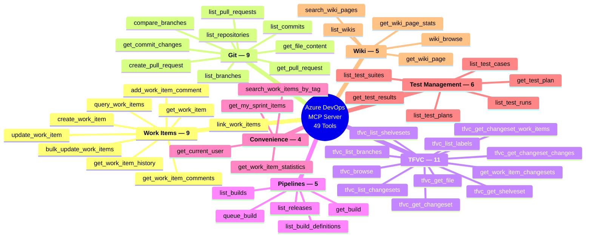

<div align="center">

# Azure DevOps MCP Server

[](https://nodejs.org/)
[](https://www.typescriptlang.org/)
[](https://modelcontextprotocol.io/)
[](https://learn.microsoft.com/en-us/azure/devops/server/)
[](LICENSE)
[](https://github.com/burcusipahioglu/azure-devops-mcp-onprem#tool-reference)
[](https://www.npmjs.com/package/@burcusg/azure-devops-mcp-onprem)

**Bring on-premises Azure DevOps Server to your AI assistant.**

Query work items, repositories, and pipelines in natural language — running locally, no cloud proxy, no telemetry.
**Full TFVC support.** **Profile-based secrets** — clean multi-instance setup without leaking PATs into `mcp.json`. Layered write safety.

[Tools](#tools) · [TFVC](#tfvc-support) · [Profiles](#profile-based-secrets) · [Write Safety](#write-safety) · [Setup](#setup)

</div>

<!-- TODO: hero demo GIF -->

---

## At a glance

| | |
|---|---|
| **49 tools / 7 domains** | Work Items · Git · **TFVC** · Pipelines · Wiki · Test Plans · Convenience |
| **TFVC native** | 11 dedicated tools — shelvesets, changesets, labels, branches. The reason this server exists. |
| **Profile-based secrets** | `AZURE_DEVOPS_PROFILE=name` → gitignored `.env.<name>`; no PAT in cloud-synced `mcp.json`. Multi-instance is a natural byproduct. |
| **Write safety** | 6 layers — MCP annotations · confirmation directive · readonly kill switch · rate limit · dry-run · audit log |
| **AI clients** | Claude (Code/Desktop), GitHub Copilot, Cursor, Visual Studio Code — any MCP-compatible client |
| **Local only** | PAT auth, no cloud proxy, no third-party calls, no telemetry |
| **`@me` token** | `owner` / `author` / `assignedTo` accept `@me` — resolved per tenant, stateless for multi-agent setups |

### Example questions

> *"Show me all active bugs assigned to me in this sprint"*
> *"What changed in changeset 12345?"*
> *"Create a PR from feature/login to develop"*
> *"List my latest shelvesets"*
> *"Trigger the nightly build on the release branch"*

---

## Tools


```mermaid
mindmap
  root((Azure DevOps<br/>MCP Server<br/>49 Tools))
    **Work Items — 9**
      query_work_items
      get_work_item
      create_work_item
      update_work_item
      get_work_item_comments
      add_work_item_comment
      link_work_items
      get_work_item_history
      bulk_update_work_items
    **Git — 9**
      list_repositories
      list_branches
      get_file_content
      list_pull_requests
      get_pull_request
      create_pull_request
      list_commits
      get_commit_changes
      compare_branches
    **TFVC — 11**
      tfvc_browse
      tfvc_get_file
      tfvc_get_changeset
      tfvc_list_changesets
      tfvc_get_changeset_changes
      tfvc_get_changeset_work_items
      tfvc_list_branches
      tfvc_list_shelvesets
      tfvc_get_shelveset
      tfvc_list_labels
      get_work_item_changesets
    **Pipelines — 5**
      list_build_definitions
      queue_build
      get_build
      list_builds
      list_releases
    **Convenience — 4**
      get_my_sprint_items
      search_work_items_by_tag
      get_work_item_statistics
      get_current_user
    **Test Management — 6**
      list_test_plans
      get_test_plan
      list_test_suites
      list_test_cases
      list_test_runs
      get_test_results
    **Wiki — 5**
      list_wikis
      get_wiki_page
      wiki_browse
      get_wiki_page_stats
      search_wiki_pages
```

Full per-tool parameter reference: [Tool Reference ↓](#tool-reference)

### Restrict tools per role

Set `AZURE_DEVOPS_ENABLED_DOMAINS` to a comma-separated list — disabled domains aren't registered, trimming the AI client's tool list and reducing tool-selection confusion. Default loads all 7.

| Role | Domains |
|------|---------|
| Project manager | `work_items,convenience,wiki` |
| Developer (TFVC) | `work_items,tfvc,pipelines,convenience` |
| Developer (Git) | `work_items,git,pipelines,convenience` |
| QA / tester | `work_items,test_plans,git` |
| DevOps / release | `work_items,pipelines,git,tfvc` |
| Read-only / analyst | `work_items,wiki,convenience` |

Unknown domain names fail at startup — no silent typos. Startup log reports what loaded:

```
Enabled domains (4/7): work_items, tfvc, pipelines, convenience
Disabled domains: git, wiki, test_plans
```

---

## TFVC support

**The reason this server exists.** Cloud Azure DevOps disabled new TFVC repos in February 2017, and Microsoft's official MCP server doesn't cover TFVC. If your team is still on Team Foundation Version Control, this is the only MCP server that exposes it natively to AI assistants.

11 dedicated TFVC tools:

- **Shelvesets** — `tfvc_list_shelvesets`, `tfvc_get_shelveset` (with file changes + work item links)
- **Changesets** — `tfvc_list_changesets`, `tfvc_get_changeset`, `tfvc_get_changeset_changes`, `tfvc_get_changeset_work_items`
- **Browse & files** — `tfvc_browse`, `tfvc_get_file` (at any changeset version)
- **Labels** — `tfvc_list_labels`
- **Branches** — `tfvc_list_branches` (with children, including deleted)
- **Work-item linkage** — `get_work_item_changesets` (all TFVC changesets touching a work item, with file contents)

Filters accept `@me` where relevant. Requires Code (read & write) PAT scope.

---

## Profile-based secrets

`mcp.json` configs sync to the cloud (Claude Desktop, VS Code Settings Sync), get pasted into tickets, end up in dotfile repos. **Inlining `AZURE_DEVOPS_PAT` there is one `git add .` away from a public leak.**

The convention: set `AZURE_DEVOPS_PROFILE=name` in `mcp.json`, keep credentials in a gitignored `.env.<name>` next to the binary. The server resolves the profile name to that file path; `mcp.json` stays free of secrets and is safe to commit.

`.env.product-a` (gitignored):

```env
AZURE_DEVOPS_ORG_URL=https://tfs-1.example.com/tfs/ProductACollection
AZURE_DEVOPS_PROJECT=Product A
AZURE_DEVOPS_PAT=<pat-for-product-a>
# Optional per-profile domain restriction
AZURE_DEVOPS_ENABLED_DOMAINS=work_items,tfvc,pipelines,convenience
```

`mcp.json` (commitable):

```json
{
  "mcpServers": {
    "ado-product-a": {
      "command": "node",
      "args": ["/path/to/dist/index.js"],
      "env": { "AZURE_DEVOPS_PROFILE": "product-a" }
    }
  }
}
```

### Multi-instance

Once profiles are in place, running multiple ADO instances side-by-side is just adding entries. Each one loads its own `.env.<profile>` — own PAT, own project, own domain restriction. Per-process state means audit logs, rate limit counters, and `@me` identity caches never cross between tenants.

```json
{
  "mcpServers": {
    "ado-product-a": {
      "command": "node",
      "args": ["/path/to/dist/index.js"],
      "env": { "AZURE_DEVOPS_PROFILE": "product-a" }
    },
    "ado-product-b": {
      "command": "node",
      "args": ["/path/to/dist/index.js"],
      "env": { "AZURE_DEVOPS_PROFILE": "product-b" }
    }
  }
}
```

Tool names auto-prefix per server — `mcp__ado-product-a__list_repositories` vs `mcp__ado-product-b__list_repositories`.

### Env file precedence

| Set in `mcp.json` | File loaded |
|-------------------|-------------|
| `AZURE_DEVOPS_ENV_FILE=/abs/path` | That exact path |
| `AZURE_DEVOPS_PROFILE=name` | `<projectRoot>/.env.name` |
| _(neither)_ | `<projectRoot>/.env` |

Variables set directly in `mcp.json`'s `env` block always win over file contents.

Each instance's startup log line `env file: ...` confirms which file was loaded — handy for debugging "which profile did this tool actually call?".

---

## Write Safety

Six layers. The LLM cannot bypass the server-side ones — they short-circuit before any API call fires.

| Layer | Scope | Enable |
|-------|-------|--------|
| **MCP annotations** | All 49 tools tagged with `readOnlyHint` / `destructiveHint` / `idempotentHint` — clients can skip read confirmations, warn on destructive writes | Always on |
| **Confirmation directive** | Every write's description tells the LLM to show payload and ask before calling | Always on |
| **Readonly mode** | Server refuses all 7 write tools with a clear error; reads unaffected. CI, demos, sandbox, emergency stop | `AZURE_DEVOPS_MODE=readonly` |
| **Rate limit** | Global sliding 60s window across all writes — runaway-loop fence, not a throughput regulator | `AZURE_DEVOPS_RATE_LIMIT_WRITES_PER_MIN=10` (default; `0` disables) |
| **Dry-run** | `add_work_item_comment`, `create_pull_request`, `queue_build` — pass `dryRun: true` for the literal API payload without firing | Per-call |
| **Audit log** | JSONL append per write: timestamp, tool, user, input, result, `dryRun`, `ok`, `durationMs`, `blocked` reason | `AZURE_DEVOPS_AUDIT_LOG=/path/to/audit.jsonl` |

**Audit privacy:** add `AZURE_DEVOPS_AUDIT_REDACT=1` to keep numeric IDs and field shape but drop all string values (titles, comments, branch names). Useful when work-item content carries classified data.

Plus baseline hardening: WIQL injection sanitization, scrubbed errors (no internal paths/URLs/stack traces in client output), bounded pagination (1-1000).

---

## Privacy & data flow

The server runs entirely locally. ADO API calls go straight from your machine to your Azure DevOps Server. No telemetry, no phone-home, no cloud proxy, no shared analytics.

External destinations are limited to:

1. **Your Azure DevOps Server** — the URL in your `.env`.
2. **Your AI assistant** (Claude, GitHub Copilot, Cursor) — the AI client reads tool outputs as conversation context per its own privacy policy. The MCP server itself never talks to these services.

| Data | Leaves your machine? |
|------|---------------------|
| PAT | ❌ Never — stays in gitignored `.env` / `.env.<profile>` |
| Work items, code, commits, shelvesets | ➡ Your ADO Server, then back to your AI assistant |
| Server / URL / project names | ➡ Your AI assistant as part of tool outputs |
| Usage metrics, error logs | ❌ No collection |

Every network call is visible in [`src/`](src/) — they all route through `azure-devops-node-api` pointed at your configured URL.

---

## Cloud (Azure DevOps Services)

Technically works against `dev.azure.com`, but **this server isn't positioned for cloud**:

- **TFVC doesn't exist on cloud** — disabled for new orgs since February 2017.
- **PAT-only auth** — many cloud tenants require Microsoft Entra ID, which this server doesn't yet support.
- **Microsoft ships [`@azure-devops/mcp`](https://github.com/microsoft/azure-devops-mcp)** for cloud — officially maintained, Entra ID, broader cloud-specific coverage.

Use this server against cloud only if you specifically need `@me`, profile-based multi-tenant config, or a convenience tool the official server lacks.

---

## Setup

Pick one path:
- **[Quick Start](#quick-start-npm)** — run from npm, no clone. ~2 minutes.
- **[Enterprise Setup](#enterprise-setup-clone)** — clone, build, pin a commit. For air-gapped or audited environments.

### Prerequisites

- **Node.js ≥ 18**
- **Azure DevOps Server 2022.2** (tested; older versions with REST API 7.x likely work but untested)
- **PAT** with the scopes below. Grant only what you need — omitted scopes make the affected tools fail at call time, but the server still starts.

| Scope | For |
|-------|-----|
| Work Items (read & write) | Work item tools, convenience tools, WIQL queries |
| Code (read & write) | Git tools, **TFVC tools**, PR creation |
| Build (read & execute) | Pipeline tools, `queue_build` |
| Release (read) | Release listing |
| Test Management (read) | Test plans, suites, runs, results |
| Wiki (read & write) | Wiki tools |

Create the PAT at `https://<your-tfs>/_usersSettings/tokens`. Set an expiration ≤ 90 days and rotate regularly.

### Quick Start (npm)

> **No public npm access?** Skip to [Enterprise Setup](#enterprise-setup-clone) — it builds from source and can use an internal npm mirror.

**1. Credential file** — create `~/.azure-devops-mcp.env` (Linux/macOS) or `C:\Users\you\.azure-devops-mcp.env` (Windows):

```env
AZURE_DEVOPS_ORG_URL=https://your-tfs-server/tfs/YourCollection
AZURE_DEVOPS_PROJECT=YourProjectName
AZURE_DEVOPS_PAT=your_pat_token
# AZURE_DEVOPS_SSL_IGNORE=true   # uncomment for self-signed certs
```

**2. Register with your AI client.** Shortest paths:

#### VS Code — one-click install

<p align="center">
  <a href="https://insiders.vscode.dev/redirect/mcp/install?name=azure-devops-mcp-onprem&config=%7B%22type%22%3A%22stdio%22%2C%22command%22%3A%22npx%22%2C%22args%22%3A%5B%22-y%22%2C%22%40burcusg%2Fazure-devops-mcp-onprem%22%5D%2C%22env%22%3A%7B%22AZURE_DEVOPS_ENV_FILE%22%3A%22%24%7BuserHome%7D%2F.azure-devops-mcp.env%22%7D%7D">
    
  </a>
</p>

#### Claude Code — one command

```bash
claude mcp add azure-devops -- npx -y @burcusg/azure-devops-mcp-onprem --env AZURE_DEVOPS_ENV_FILE=$HOME/.azure-devops-mcp.env
```

#### Other clients (Claude Desktop / Cursor / Antigravity / Codex CLI)

JSON config — see [Configure AI client](#configure-ai-client) below.

### Enterprise Setup (clone)

```bash
git clone https://github.com/burcusipahioglu/azure-devops-mcp-onprem.git
cd azure-devops-mcp-onprem
npm install
npm run build
cp .env.example .env       # copy .env.example .env on Windows
# fill in .env with your TFS details
npm start                  # smoke-test the connection — Ctrl+C to stop
```

Expected stderr on startup:

```
Azure DevOps MCP Server "CompanyOrg" running on stdio
env file: /path/to/.env
Authenticated as: Your Name (your.email@company.com)
```

Then point your AI client at `dist/index.js` (see below). No `env` block needed — the server reads `.env` from the repo root.

### Configure AI client

> ⚠ **Never inline `AZURE_DEVOPS_PAT` / `AZURE_DEVOPS_ORG_URL` / `AZURE_DEVOPS_PROJECT` in client configs.** Client configs sync to the cloud (Claude Desktop sync, VS Code Settings Sync) or get pasted into tickets. Use `AZURE_DEVOPS_ENV_FILE` (Quick Start) or `.env` in the repo (Enterprise Setup). For multiple TFS instances see [Profile-based secrets](#profile-based-secrets).

| Client | Path |
|--------|------|
| **VS Code** | Includes `.vscode/mcp.json`. Copilot Chat → Agent mode (`Ctrl+Shift+I`) |
| **GitHub Copilot CLI** | `/mcp add` (interactive) or edit `~/.copilot/mcp-config.json` |
| **Claude Code** | `claude mcp add azure-devops -- node /path/to/dist/index.js` |
| **Claude Desktop** | Edit `%APPDATA%\Claude\claude_desktop_config.json` (Windows) / `~/Library/Application Support/Claude/claude_desktop_config.json` (macOS) |
| **Cursor / Antigravity / Codex CLI** | Standard MCP JSON config — same shape as Claude Desktop |

Enterprise Setup config template (any client):

```json
{
  "mcpServers": {
    "azure-devops": {
      "command": "node",
      "args": ["/absolute/path/to/azure-devops-mcp-onprem/dist/index.js"]
    }
  }
}
```

Quick Start config template (npm + credential file):

```json
{
  "mcpServers": {
    "azure-devops": {
      "command": "npx",
      "args": ["-y", "@burcusg/azure-devops-mcp-onprem"],
      "env": {
        "AZURE_DEVOPS_ENV_FILE": "C:\\Users\\you\\.azure-devops-mcp.env"
      }
    }
  }
}
```

Restart the client. All 49 tools appear in the tool picker. Server name is auto-detected from `AZURE_DEVOPS_ORG_URL` (e.g. `https://dev.azure.com/acme` → `acme`); override with `AZURE_DEVOPS_SERVER_NAME`.

---

## Tool Reference

### Work Items (7 tools)

| Tool | Description | Key Parameters |
|------|-------------|----------------|
| `query_work_items` | Execute a WIQL query | `query`, `top` |
| `get_work_item` | Get work item by ID | `id`, `expand` (none/relations/fields/links/all) |
| `create_work_item` | Create a new work item | `type`, `title`, `description`, `assignedTo` (accepts `@me`), `areaPath`, `iterationPath` |
| `update_work_item` | Update work item fields (returns before/after diff) | `id`, `fields` (key-value map) |
| `get_work_item_comments` | List comments (paginated, asc/desc, optional rendered HTML) | `workItemId`, `top`, `order`, `includeRenderedText`, `continuationToken` |
| `add_work_item_comment` | Add a comment | `workItemId`, `text` |
| `link_work_items` | Link two work items | `sourceId`, `targetId`, `linkType` |

### Work Items Advanced (2 tools)

| Tool | Description | Key Parameters |
|------|-------------|----------------|
| `get_work_item_history` | Full change audit trail (who/what/when with old/new values) | `workItemId`, `top`, `skip` |
| `bulk_update_work_items` | Batch update with detailed before/after report | `ids`, `fields` |

### Git (6 tools)

| Tool | Description | Key Parameters |
|------|-------------|----------------|
| `list_repositories` | List all Git repos in project | — |
| `list_branches` | List branches in a repo | `repositoryId` |
| `get_file_content` | Get file content from repo | `repositoryId`, `path`, `branch` |
| `list_pull_requests` | List PRs with filter | `repositoryId`, `status`, `top` |
| `get_pull_request` | Get PR details | `repositoryId`, `pullRequestId` |
| `create_pull_request` | Create a new PR | `repositoryId`, `title`, `sourceBranch`, `targetBranch` |

### Git Advanced (3 tools)

| Tool | Description | Key Parameters |
|------|-------------|----------------|
| `list_commits` | Commit history with filters | `repositoryId`, `branch`, `author` (accepts `@me`), `fromDate`, `toDate`, `itemPath` |
| `get_commit_changes` | File changes in a commit | `repositoryId`, `commitId` |
| `compare_branches` | Branch diff (ahead/behind + changed files) | `repositoryId`, `baseBranch`, `targetBranch` |

### TFVC (11 tools)

| Tool | Description | Key Parameters |
|------|-------------|----------------|
| `tfvc_browse` | Browse files/folders at a TFVC path | `scopePath`, `recursion` |
| `tfvc_get_file` | Get file content | `path`, `version` (changeset number) |
| `tfvc_get_changeset` | Get changeset details | `id`, `includeWorkItems`, `includeDetails` |
| `tfvc_list_changesets` | List changesets with filters | `itemPath`, `author` (accepts `@me`), `fromDate`, `toDate`, `top` |
| `tfvc_get_changeset_changes` | List file changes in a changeset | `changesetId`, `top` |
| `tfvc_get_changeset_work_items` | Get linked work items | `changesetId` |
| `tfvc_list_branches` | List TFVC branches | `includeChildren`, `includeDeleted` |
| `tfvc_list_shelvesets` | List shelvesets (sorted newest-first) | `owner` (accepts `@me`), `top` |
| `tfvc_get_shelveset` | Get shelveset details + changes | `shelvesetId`, `includeWorkItems` |
| `tfvc_list_labels` | List TFVC labels | `name`, `owner` (accepts `@me`), `top` |
| `get_work_item_changesets` | All TFVC changesets linked to a work item (with file changes) | `workItemId`, `includeFileContent`, `maxFiles` |

### Pipelines (5 tools)

| Tool | Description | Key Parameters |
|------|-------------|----------------|
| `list_build_definitions` | List pipeline definitions | `name`, `top` |
| `queue_build` | Trigger a build | `definitionId`, `sourceBranch`, `parameters` |
| `get_build` | Get build status | `buildId` |
| `list_builds` | List recent builds | `definitionId`, `status`, `top` |
| `list_releases` | List releases | `definitionId`, `top` |

### Convenience (4 tools)

| Tool | Description | Key Parameters |
|------|-------------|----------------|
| `get_my_sprint_items` | Get your current sprint items | `workItemType`, `states` |
| `search_work_items_by_tag` | Search work items by tags | `tags`, `workItemType`, `state`, `top` |
| `get_work_item_statistics` | Work item counts by area path (handles 20K+ items) | `workItemTypes`, `days`, `states`, `areaPathPrefix`, `areaPathContains`, `groupByDepth`, `topAreas` |
| `get_current_user` | Identity of the authenticated PAT owner (displayName, id, uniqueName) | — |

### Test Management (6 tools)

| Tool | Description | Key Parameters |
|------|-------------|----------------|
| `list_test_plans` | List test plans | `filterActivePlans`, `includePlanDetails` |
| `get_test_plan` | Get test plan details | `planId` |
| `list_test_suites` | List suites in a test plan | `planId`, `asTreeView` |
| `list_test_cases` | List test cases in a suite | `planId`, `suiteId` |
| `list_test_runs` | List test runs (manual/automated) | `planId`, `automated`, `top` |
| `get_test_results` | Test results with pass/fail and errors | `runId`, `outcomes`, `top` |

### Wiki (5 tools)

| Tool | Description | Key Parameters |
|------|-------------|----------------|
| `list_wikis` | List all wikis (project + code wikis) | — |
| `get_wiki_page` | Get page content in Markdown | `wikiIdentifier`, `path` |
| `wiki_browse` | Browse wiki page tree | `wikiIdentifier`, `path` |
| `get_wiki_page_stats` | Page view statistics | `wikiIdentifier`, `pageId`, `pageViewsForDays` |
| `search_wiki_pages` | Batch fetch pages with view stats | `wikiIdentifier`, `top` |

---

## `@me` token

Several filter parameters accept the magic token `@me` — the server resolves it to the authenticated PAT owner's display name via Azure DevOps `ConnectionData`. The identity is cached for the lifetime of the process.

**Why:** in multi-agent setups, sub-agents rarely know the human's display name. `@me` lets any agent filter to "my stuff" without needing identity context.

| Tool | Parameter |
|------|-----------|
| `tfvc_list_shelvesets` | `owner` |
| `tfvc_list_changesets` | `author` |
| `tfvc_list_labels` | `owner` |
| `list_commits` | `author` |
| `create_work_item` | `assignedTo` |

```jsonc
// "Show me my latest shelveset"
tfvc_list_shelvesets({ owner: "@me", top: 1 })

// "Which commits did I push to feature/login this week?"
list_commits({ repositoryId: "my-repo", branch: "feature/login", author: "@me", fromDate: "2026-04-10" })
```

> WIQL queries (`query_work_items`, `get_my_sprint_items`) use Azure DevOps' native `@Me` macro — no server-side resolution needed.

Need the identity explicitly? Call `get_current_user`.

---

## Development

```bash
npm run dev      # watch mode
npm run build    # build once
npm start        # start the server
```

---

## License

Released under the [MIT License](LICENSE). Copyright (c) 2026 Burcu Sipahioglu Gokbulut.

Free to use, modify, and redistribute — commercial or personal — provided the copyright notice and license text are preserved.
